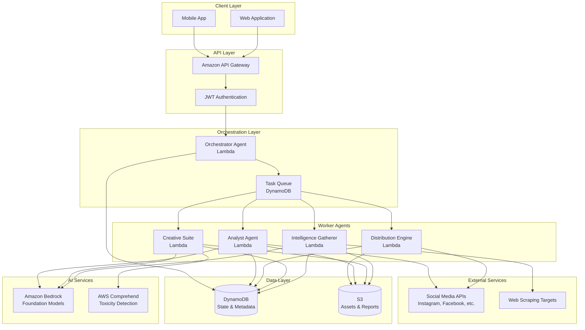
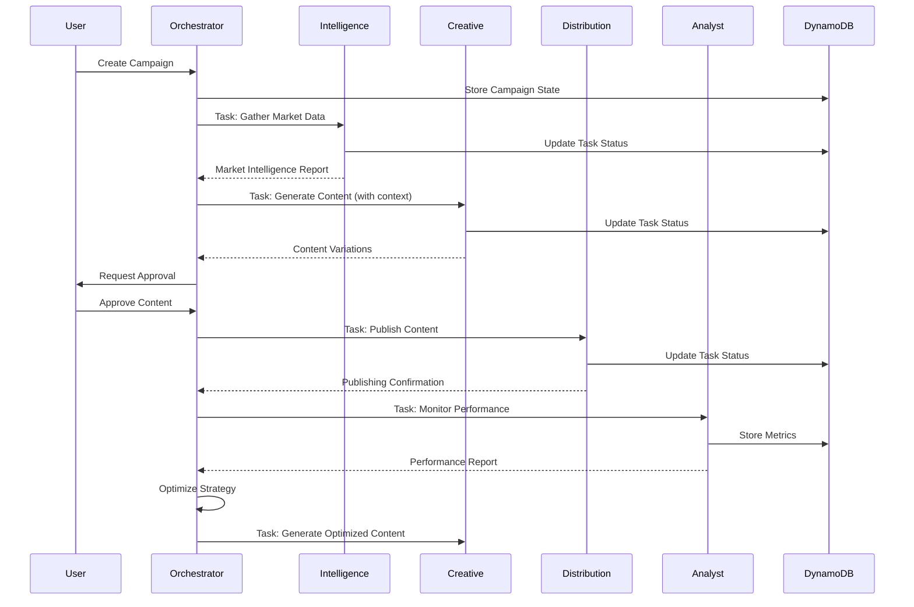

# Design Document: Insta Media AI

## Overview

Insta Media AI is built on an Orchestrator-Worker Multi-Agent Architecture that coordinates specialized AI agents to deliver autonomous marketing operations. The system leverages AWS serverless infrastructure for scalability and cost-efficiency, with Amazon Bedrock providing the foundation for AI-powered content generation and decision-making.

The architecture follows event-driven patterns where the Orchestrator acts as the central coordinator, delegating tasks to specialized agents (Intelligence Gatherer, Creative Suite, Distribution Engine, and Analyst Agent) that operate independently but maintain state coherence through DynamoDB. This design enables parallel processing, fault isolation, and independent scaling of each agent based on workload.

## Architecture

## 1. System Architecture

```
┌──────────────────────────────────────────────────────────────┐
│                  React + TypeScript UI                        │
│  Overview │ Brand DNA │ Ideation │ Studio │ Calendar          │
└─────────────────────┬────────────────────────────────────────┘
                      │  REST API (JSON/HTTP)
┌─────────────────────▼────────────────────────────────────────┐
│                  Flask API Layer (Python)                      │
│  /api/brand-dna  /api/ideate  /api/studio/generate            │
│  /api/analyze    /api/posts/*  /api/seed  /api/health         │
└────────┬─────────────────────────────┬────────────────────────┘
         │                             │
┌────────▼──────────┐       ┌──────────▼─────────────────────┐
│   ESG Engine      │       │     Supabase (PostgreSQL)       │
│  ─────────────    │       │  brand_dna table                │
│  ChromaDB         │       │  scheduled_posts table          │
│  sentence-        │       │  Supabase Storage (logos)       │
│  transformers     │       └────────────────────────────────┘
│  ERS Calculator   │
│  Re-ranking Logic │
└────────┬──────────┘
         │  Prompt with top-5 ERS posts
┌────────▼──────────────────────────────────────────────────┐
│          LLM Layer (Gemini 1.5 Flash / Groq Llama 3.1)     │
│  Ideation Agent │ Generator Agent │ Emotional Aligner      │
└───────────────────────────────────────────────────────────┘
```

---
### System Architecture Diagram



### Multi-Agent Coordination Flow



## Components and Interfaces

### 1. API Gateway Layer

**Purpose**: Unified entry point for all client requests with authentication, rate limiting, and request routing.

**Endpoints**:

```
POST   /api/v1/auth/register
POST   /api/v1/auth/login
POST   /api/v1/auth/refresh

GET    /api/v1/profile
PUT    /api/v1/profile
POST   /api/v1/profile/assets

POST   /api/v1/campaigns
GET    /api/v1/campaigns
GET    /api/v1/campaigns/{id}
PUT    /api/v1/campaigns/{id}
DELETE /api/v1/campaigns/{id}

GET    /api/v1/campaigns/{id}/content
POST   /api/v1/campaigns/{id}/content/approve
POST   /api/v1/campaigns/{id}/content/reject
POST   /api/v1/campaigns/{id}/content/modify

GET    /api/v1/campaigns/{id}/analytics
GET    /api/v1/campaigns/{id}/calendar

POST   /api/v1/intelligence/analyze
GET    /api/v1/intelligence/reports/{id}

GET    /api/v1/templates
POST   /api/v1/templates
GET    /api/v1/templates/{id}

POST   /api/v1/platforms/connect
GET    /api/v1/platforms
DELETE /api/v1/platforms/{platform}

GET    /api/v1/subscription
PUT    /api/v1/subscription
GET    /api/v1/subscription/usage
```

**Authentication Flow**:
- JWT-based authentication with access and refresh tokens
- Access token expiry: 1 hour
- Refresh token expiry: 30 days
- Token payload includes: user_id, subscription_tier, permissions

**Rate Limiting**:
- Basic tier: 100 requests/minute
- Pro tier: 500 requests/minute
- Enterprise tier: 2000 requests/minute

### ## 2. ESG Engine — Core AI Algorithm

### 2.1 Emotional Resonance Score (ERS)

```python
def calculate_ers(likes: int, comments: int, shares: int) -> float:
    """
    Weights reflect emotional INTENT signal strength:
      shares   0.8 → "This represents me" — highest commitment
      comments 0.5 → Active emotional response, friction > likes
      likes    0.2 → Passive acknowledgment, lowest intent signal

    Log normalization prevents viral outliers from compressing all
    other posts to near-zero.
    """
    raw = (likes * 0.2) + (comments * 0.5) + (shares * 0.8)
    return min(round(math.log1p(raw) * 10, 2), 100.0)
```

### 2.2 Semantic Re-Ranking

ChromaDB returns the top-20 most *semantically similar* posts. We re-rank by a combined score that balances relevance (semantic) with emotional quality (ERS):

```python
combined_score = (semantic_similarity * 0.4) + (ers_normalized * 0.6)

# Why 60% ERS weight?
# A post about "product features" with ERS=9 is less useful for
# conditioning than a "founder story" post with ERS=87, even if
# the former is more topically similar to the draft.
```

### 2.3 ChromaDB Storage Schema

```python
collection.add(
    ids=["post_42"],
    embeddings=[[0.12, -0.34, ...]],   # 384-dim via all-MiniLM-L6-v2
    documents=["We almost shut down last year..."],
    metadatas=[{
        "ers": 68.4,
        "likes": 3200,
        "comments": 412,
        "shares": 890,
        "platform": "instagram"
    }]
)
```

### 2.4 Emotional Aligner Prompt Design

```
[ROLE]        → Emotional Alignment Checker with scoring criteria
[CONTEXT]     → Brand's top 5 combined-score reference posts (with ERS)
[DRAFT]       → The user's current draft text
[BANNED CHECK]→ Any banned words detected (from Brand DNA)
[OUTPUT]      → Strict JSON schema — resonance_score, verdict,
                emotional_archetype, what_works, what_is_missing,
                missing_signals[], rewrite_suggestion, confidence
[CALIBRATION] → Score guide embedded: 80-100 (great), 60-79 (close),
                40-59 (flat), 0-39 (misaligned)
```

Forcing JSON output prevents the LLM from hedging — we parse structured data, not prose.

### 2.5 Cold Start Strategy

```
New brand with 0 posts
         │
         ▼
1. Brand intake form: industry category + tone + 3 reference brands
         │
         ▼
2. Find closest archetype cluster in training corpus
   (same category + similar tone descriptor overlap)
         │
         ▼
3. Transfer EPM weights from matched cluster as starting prior
   (UI shows "bootstrap confidence — low")
         │
         ▼
4. Rapid validation: 5 test posts across emotional registers → publish
         │
         ▼
5. After ~30 data points: EPM diverges to brand-specific model
   (standard confidence restored)
```

---

Orchestrator Agent

**Purpose**: Central coordinator that interprets user goals, manages task dependencies, and coordinates all worker agents.

**Core Responsibilities**:
- Campaign strategy generation
- Task decomposition and delegation
- State management and consistency
- Error handling and retry logic
- Optimization decision-making

**Interface**:

```typescript
interface OrchestratorAgent {
  // Campaign Management
  createCampaign(request: CampaignRequest): Promise<Campaign>
  updateCampaignStrategy(campaignId: string, metrics: PerformanceMetrics): Promise<void>
  
  // Task Coordination
  delegateTask(task: Task): Promise<TaskResult>
  handleTaskCompletion(taskId: string, result: TaskResult): Promise<void>
  handleTaskFailure(taskId: string, error: Error): Promise<void>
  
  // Decision Making
  generateContentStrategy(campaign: Campaign, intelligence: MarketIntelligence): ContentStrategy
  optimizeCampaign(campaign: Campaign, analytics: AnalyticsReport): OptimizationPlan
}

interface CampaignRequest {
  userId: string
  brandProfile: BrandProfile
  objectives: CampaignObjective[]
  duration: DateRange
  budget?: number
  targetPlatforms: Platform[]
  targetLanguages: string[]
}

interface Campaign {
  id: string
  userId: string
  status: 'draft' | 'active' | 'paused' | 'completed'
  strategy: ContentStrategy
  calendar: ContentCalendar
  createdAt: Date
  updatedAt: Date
}

interface Task {
  id: string
  campaignId: string
  type: 'intelligence' | 'content_creation' | 'distribution' | 'analytics'
  priority: number
  dependencies: string[]
  payload: any
  status: 'pending' | 'in_progress' | 'completed' | 'failed'
  retryCount: number
  maxRetries: number
}
```

**Decision Logic**:

The Orchestrator uses a rule-based system augmented with LLM reasoning for complex decisions:

1. **Campaign Strategy Generation**:
   - Analyze brand profile and objectives
   - Invoke Foundation Model with prompt: "Given business profile {profile} and objectives {objectives}, generate a marketing strategy for Indian SMB market"
   - Parse LLM response into structured ContentStrategy
   - Validate strategy against subscription limits

2. **Task Prioritization**:
   - Priority = (deadline_urgency * 0.4) + (user_tier * 0.3) + (dependency_depth * 0.3)
   - Tasks with failed dependencies are deprioritized
   - User-requested modifications get highest priority

3. **Optimization Decisions**:
   - If engagement_rate < baseline * 0.7 for 3 consecutive posts: trigger strategy review
   - If CTR > baseline * 1.5: increase similar content frequency
   - A/B test winner selection: statistical significance p < 0.05

### 3. Intelligence Gatherer Agent

**Purpose**: Autonomous web scraping and market analysis agent that provides competitive intelligence.

**Core Responsibilities**:
- Ethical web scraping with rate limiting
- Competitor content analysis
- Trend identification
- Market sentiment analysis

**Interface**:

```typescript
interface IntelligenceGatherer {
  scrapeCompetitors(targets: CompetitorTarget[]): Promise<ScrapedData>
  analyzeTrends(industry: string, region: string): Promise<TrendReport>
  generateIntelligenceReport(data: ScrapedData): Promise<MarketIntelligence>
}

interface CompetitorTarget {
  name: string
  website?: string
  socialProfiles: {
    platform: Platform
    handle: string
  }[]
}

interface ScrapedData {
  competitor: string
  contentSamples: ContentSample[]
  postingFrequency: number
  engagementMetrics: EngagementMetrics
  contentThemes: string[]
  scrapedAt: Date
}

interface MarketIntelligence {
  id: string
  industry: string
  region: string
  trendingTopics: Topic[]
  competitorInsights: CompetitorInsight[]
  recommendations: string[]
  generatedAt: Date
}

interface Topic {
  keyword: string
  volume: number
  sentiment: 'positive' | 'neutral' | 'negative'
  relevanceScore: number
}
```

**Scraping Strategy**:

1. **Robots.txt Compliance**:
   - Check robots.txt before scraping any domain
   - Respect crawl-delay directives
   - Skip disallowed paths

2. **Rate Limiting**:
   - Maximum 1 request per 2 seconds per domain
   - Implement exponential backoff on 429 responses
   - Rotate user agents to avoid detection

3. **Data Extraction**:
   - Use CSS selectors for structured data
   - Extract: post text, images, timestamps, engagement counts
   - Store raw HTML in S3 for audit trail

4. **Analysis Pipeline**:
   - Pass scraped text to Bedrock for theme extraction
   - Prompt: "Analyze these social media posts and identify: 1) Main themes, 2) Tone and voice, 3) Call-to-action patterns, 4) Cultural references"
   - Aggregate insights across competitors

### 4. Creative Suite Agent

**Purpose**: Generative AI agent for creating marketing content across text, image, and video formats.

**Core Responsibilities**:
- Multi-format content generation
- Brand voice consistency
- Cultural localization
- Content safety validation

**Interface**:

```typescript
interface CreativeSuite {
  generateTextContent(request: TextContentRequest): Promise<TextContent[]>
  generateImageContent(request: ImageContentRequest): Promise<ImageContent[]>
  generateVideoScript(request: VideoScriptRequest): Promise<VideoScript>
  validateContentSafety(content: string): Promise<SafetyResult>
}

interface TextContentRequest {
  campaignId: string
  contentType: 'social_post' | 'ad_copy' | 'blog_outline' | 'email' | 'product_description'
  platform: Platform
  language: string
  brandVoice: BrandVoice
  context: {
    marketIntelligence?: MarketIntelligence
    productInfo?: ProductInfo
    targetAudience?: AudienceSegment
  }
  variationCount: number
}

interface TextContent {
  id: string
  text: string
  hashtags: string[]
  callToAction?: string
  characterCount: number
  safetyScore: number
  metadata: {
    generatedAt: Date
    modelUsed: string
    promptVersion: string
  }
}

interface ImageContentRequest {
  campaignId: string
  textContent: TextContent
  brandAssets: BrandAssets
  dimensions: ImageDimensions
  style: 'modern' | 'traditional' | 'minimalist' | 'vibrant'
}

interface ImageContent {
  id: string
  s3Key: string
  url: string
  dimensions: ImageDimensions
  prompt: string
  metadata: {
    generatedAt: Date
    modelUsed: string
  }
}

interface VideoScript {
  id: string
  title: string
  duration: number
  scenes: Scene[]
  voiceover: string[]
  textOverlays: TextOverlay[]
  musicSuggestions: string[]
}

interface Scene {
  sceneNumber: number
  duration: number
  description: string
  visualElements: string[]
  dialogue?: string
}
```

**Content Generation Pipeline**:

1. **Text Generation**:
   ```
   Step 1: Build context-rich prompt
   - Include brand voice guidelines
   - Add market intelligence insights
   - Specify platform constraints (character limits)
   - Include cultural context for target region
   
   Step 2: Invoke Bedrock Foundation Model
   - Model: Claude 3 Sonnet for balanced quality/speed
   - Temperature: 0.7 for creative variation
   - Max tokens: 500 for social posts, 2000 for blog outlines
   
   Step 3: Generate multiple variations
   - Request 3-5 variations per prompt
   - Ensure diversity through temperature sampling
   
   Step 4: Post-process
   - Extract hashtags
   - Validate character counts
   - Format for platform requirements
   ```

2. **Safety Validation**:
   ```
   Step 1: AWS Comprehend Toxicity Detection
   - Analyze text for: profanity, hate speech, insults, threats
   - Threshold: toxicity_score < 0.3
   
   Step 2: Custom Cultural Filter
   - Check against dictionary of sensitive terms
   - Categories: religious, political, caste-related
   - Action: reject if any match found
   
   Step 3: Brand Safety Check
   - Ensure no competitor mentions
   - Validate tone matches brand guidelines
   - Check for factual claims requiring verification
   ```

3. **Image Generation**:
   ```
   Step 1: Generate image prompt from text content
   - Extract key visual concepts
   - Add brand color palette
   - Specify composition and style
   
   Step 2: Invoke Bedrock Image Model
   - Model: Amazon Titan Image Generator
   - Include negative prompts to avoid unwanted elements
   - Generate at high resolution (1024x1024 base)
   
   Step 3: Post-process
   - Resize for platform requirements
   - Add logo overlay if specified
   - Compress for optimal file size
   - Store in S3 with metadata
   ```

4. **Video Script Generation**:
   ```
   Step 1: Analyze content and platform
   - Determine optimal duration (15s, 30s, 60s)
   - Identify hook, content, CTA structure
   
   Step 2: Generate scene breakdown
   - Prompt: "Create a {duration} second video script for {platform} about {topic}. Include: hook in first 3 seconds, main content, strong CTA. Format as scene-by-scene breakdown."
   
   Step 3: Add production details
   - Suggest shot types (close-up, wide, etc.)
   - Recommend transitions
   - Specify text overlay timing
   ```

### 5. Distribution Engine Agent

**Purpose**: Multi-platform publishing agent that handles content scheduling and delivery.

**Core Responsibilities**:
- OAuth management for social platforms
- Platform-specific formatting
- Scheduled publishing
- Error handling and retries

**Interface**:

```typescript
interface DistributionEngine {
  publishContent(request: PublishRequest): Promise<PublishResult>
  scheduleContent(request: ScheduleRequest): Promise<void>
  cancelScheduledPost(postId: string): Promise<void>
  retryFailedPost(postId: string): Promise<PublishResult>
}

interface PublishRequest {
  campaignId: string
  contentId: string
  platform: Platform
  content: {
    text?: string
    imageUrls?: string[]
    videoUrl?: string
  }
  scheduledTime?: Date
  metadata: {
    hashtags?: string[]
    location?: string
    mentions?: string[]
  }
}

interface PublishResult {
  success: boolean
  platform: Platform
  platformPostId?: string
  publishedAt?: Date
  error?: {
    code: string
    message: string
    retryable: boolean
  }
}

interface Platform {
  name: 'instagram' | 'facebook' | 'linkedin' | 'twitter' | 'youtube'
  accountId: string
  accessToken: string
  tokenExpiry: Date
}
```

**Platform Integration Details**:

1. **Instagram**:
   - API: Instagram Graph API
   - Authentication: Facebook OAuth 2.0
   - Content types: Feed posts, Stories, Reels
   - Limitations: No direct story posting (requires manual approval), Reels require video upload to container
   - Publishing flow:
     ```
     1. Upload media to Instagram container
     2. Create media object with caption
     3. Publish container to feed
     4. Poll for publishing status
     ```

2. **Facebook**:
   - API: Facebook Graph API
   - Authentication: Facebook OAuth 2.0
   - Content types: Posts, Photos, Videos, Stories
   - Publishing flow:
     ```
     1. Upload media to Facebook CDN
     2. Create post with media ID and text
     3. Receive post ID immediately
     ```

3. **LinkedIn**:
   - API: LinkedIn Marketing API
   - Authentication: LinkedIn OAuth 2.0
   - Content types: Posts, Articles, Videos
   - Publishing flow:
     ```
     1. Register upload for media
     2. Upload media to provided URL
     3. Create share with media URN
     ```

4. **Twitter (X)**:
   - API: Twitter API v2
   - Authentication: OAuth 2.0 with PKCE
   - Content types: Tweets, Threads, Media
   - Publishing flow:
     ```
     1. Upload media via media endpoint
     2. Create tweet with media IDs
     3. For threads: chain tweets with reply_to
     ```

5. **YouTube**:
   - API: YouTube Data API v3
   - Authentication: Google OAuth 2.0
   - Content types: Videos, Shorts
   - Publishing flow:
     ```
     1. Initiate resumable upload
     2. Upload video file in chunks
     3. Set video metadata and privacy
     4. Publish or schedule
     ```

**Error Handling Strategy**:

```typescript
interface RetryPolicy {
  maxRetries: 3
  backoffMultiplier: 2
  initialDelay: 1000 // ms
  
  retryableErrors: [
    'RATE_LIMIT_EXCEEDED',
    'TEMPORARY_UNAVAILABLE',
    'NETWORK_ERROR',
    'TIMEOUT'
  ]
  
  nonRetryableErrors: [
    'INVALID_TOKEN',
    'INSUFFICIENT_PERMISSIONS',
    'CONTENT_POLICY_VIOLATION',
    'INVALID_MEDIA_FORMAT'
  ]
}
```

### 6. Analyst Agent

**Purpose**: Performance monitoring and analytics agent that tracks campaign effectiveness.

**Core Responsibilities**:
- Metrics collection from platform APIs
- Time-series data analysis
- Performance reporting
- Insight generation

**Interface**:

```typescript
interface AnalystAgent {
  collectMetrics(campaignId: string): Promise<void>
  generateReport(campaignId: string, period: DateRange): Promise<AnalyticsReport>
  identifyInsights(metrics: PerformanceMetrics[]): Promise<Insight[]>
  comparePerformance(campaignId: string, baseline: PerformanceMetrics): Promise<ComparisonReport>
}

interface PerformanceMetrics {
  postId: string
  platform: Platform
  publishedAt: Date
  impressions: number
  reach: number
  engagement: {
    likes: number
    comments: number
    shares: number
    saves: number
    clicks: number
  }
  engagementRate: number
  clickThroughRate: number
  audienceDemographics: {
    ageGroups: Record<string, number>
    genders: Record<string, number>
    locations: Record<string, number>
  }
  collectedAt: Date
}

interface AnalyticsReport {
  campaignId: string
  period: DateRange
  summary: {
    totalPosts: number
    totalImpressions: number
    totalEngagement: number
    averageEngagementRate: number
    topPerformingPost: PostSummary
    worstPerformingPost: PostSummary
  }
  trends: Trend[]
  insights: Insight[]
  recommendations: Recommendation[]
}

interface Insight {
  type: 'positive' | 'negative' | 'neutral'
  category: 'content' | 'timing' | 'audience' | 'platform'
  description: string
  confidence: number
  supportingData: any
}

interface Recommendation {
  priority: 'high' | 'medium' | 'low'
  action: string
  expectedImpact: string
  implementationComplexity: 'easy' | 'moderate' | 'complex'
}
```

**Analytics Pipeline**:

1. **Metrics Collection**:
   ```
   Schedule: Every 6 hours for active campaigns
   
   For each published post:
     1. Call platform API to fetch latest metrics
     2. Calculate derived metrics (engagement rate, CTR)
     3. Store in DynamoDB with timestamp
     4. Update campaign aggregate metrics
   
   Error handling:
     - If API rate limit hit: exponential backoff
     - If token expired: trigger refresh flow
     - If post deleted: mark as inactive
   ```

2. **Trend Analysis**:
   ```
   Algorithm: Moving average with anomaly detection
   
   For each metric:
     1. Calculate 7-day moving average
     2. Compute standard deviation
     3. Flag values > 2 std deviations as anomalies
     4. Identify upward/downward trends using linear regression
   
   Trend classification:
     - Strong upward: slope > 0.1, R² > 0.7
     - Moderate upward: slope > 0.05, R² > 0.5
     - Stable: |slope| < 0.05
     - Moderate downward: slope < -0.05, R² > 0.5
     - Strong downward: slope < -0.1, R² > 0.7
   ```

3. **Insight Generation**:
   ```
   Use Foundation Model for qualitative analysis:
   
   Prompt template:
   "Analyze this campaign performance data: {metrics}
   
   Identify:
   1. What content types perform best?
   2. What posting times get highest engagement?
   3. Which audience segments are most responsive?
   4. Any concerning trends?
   5. Actionable recommendations for improvement
   
   Format as structured insights with confidence scores."
   
   Post-process:
     - Parse LLM response into Insight objects
     - Validate confidence scores
     - Rank by priority
   ```

## Data Models

### DynamoDB Table Schemas

**Table: Users**
```typescript
interface UserRecord {
  PK: string // "USER#{userId}"
  SK: string // "PROFILE"
  userId: string
  email: string
  passwordHash: string
  subscriptionTier: 'basic' | 'pro' | 'enterprise'
  subscriptionStatus: 'active' | 'cancelled' | 'expired'
  subscriptionExpiry: string // ISO date
  createdAt: string
  updatedAt: string
  
  // GSI for email lookup
  GSI1PK: string // "EMAIL#{email}"
  GSI1SK: string // "USER"
}
```

**Table: BrandProfiles**
```typescript
interface BrandProfileRecord {
  PK: string // "USER#{userId}"
  SK: string // "BRAND_PROFILE"
  businessName: string
  industry: string
  targetAudience: {
    ageRange: string
    interests: string[]
    locations: string[]
  }
  brandVoice: {
    tone: string[] // e.g., ["professional", "friendly", "humorous"]
    keywords: string[]
    avoidWords: string[]
  }
  brandAssets: {
    logoS3Key?: string
    colorPalette: string[]
    fonts: string[]
  }
  languages: string[]
  updatedAt: string
}
```

**Table: Campaigns**
```typescript
interface CampaignRecord {
  PK: string // "USER#{userId}"
  SK: string // "CAMPAIGN#{campaignId}"
  campaignId: string
  name: string
  status: 'draft' | 'active' | 'paused' | 'completed'
  objectives: string[]
  startDate: string
  endDate: string
  targetPlatforms: string[]
  budget?: number
  strategy: {
    contentTypes: string[]
    postingFrequency: number
    targetLanguages: string[]
  }
  createdAt: string
  updatedAt: string
  
  // GSI for status queries
  GSI1PK: string // "USER#{userId}#STATUS#{status}"
  GSI1SK: string // campaignId
}
```

**Table: Tasks**
```typescript
interface TaskRecord {
  PK: string // "CAMPAIGN#{campaignId}"
  SK: string // "TASK#{taskId}"
  taskId: string
  type: 'intelligence' | 'content_creation' | 'distribution' | 'analytics'
  status: 'pending' | 'in_progress' | 'completed' | 'failed'
  priority: number
  dependencies: string[]
  payload: any
  result?: any
  error?: {
    message: string
    code: string
    timestamp: string
  }
  retryCount: number
  maxRetries: number
  createdAt: string
  updatedAt: string
  
  // GSI for status-based queries
  GSI1PK: string // "STATUS#{status}"
  GSI1SK: string // priority (as sortable number)
}
```

**Table: Content**
```typescript
interface ContentRecord {
  PK: string // "CAMPAIGN#{campaignId}"
  SK: string // "CONTENT#{contentId}"
  contentId: string
  type: 'text' | 'image' | 'video_script'
  status: 'pending_review' | 'approved' | 'rejected' | 'published'
  platform: string
  language: string
  textContent?: string
  imageS3Keys?: string[]
  videoScriptS3Key?: string
  metadata: {
    generatedAt: string
    modelUsed: string
    safetyScore: number
  }
  approvalHistory: {
    action: 'approved' | 'rejected' | 'modified'
    timestamp: string
    feedback?: string
  }[]
  publishedPostId?: string
  publishedAt?: string
  createdAt: string
  updatedAt: string
  
  // GSI for status queries
  GSI1PK: string // "CAMPAIGN#{campaignId}#STATUS#{status}"
  GSI1SK: string // createdAt
}
```

**Table: Analytics**
```typescript
interface AnalyticsRecord {
  PK: string // "POST#{postId}"
  SK: string // "METRICS#{timestamp}"
  postId: string
  campaignId: string
  platform: string
  metrics: {
    impressions: number
    reach: number
    likes: number
    comments: number
    shares: number
    saves: number
    clicks: number
  }
  derivedMetrics: {
    engagementRate: number
    clickThroughRate: number
  }
  timestamp: string
  
  // GSI for campaign-level queries
  GSI1PK: string // "CAMPAIGN#{campaignId}"
  GSI1SK: string // timestamp
}
```

**Table: MarketIntelligence**
```typescript
interface MarketIntelligenceRecord {
  PK: string // "USER#{userId}"
  SK: string // "INTELLIGENCE#{reportId}"
  reportId: string
  industry: string
  region: string
  trendingTopics: {
    keyword: string
    volume: number
    sentiment: string
  }[]
  competitorInsights: {
    competitor: string
    contentThemes: string[]
    postingFrequency: number
    avgEngagement: number
  }[]
  recommendations: string[]
  rawDataS3Key: string
  generatedAt: string
  expiresAt: string // TTL for automatic cleanup
}
```

### S3 Bucket Structure

```
insta-media-ai-assets/
├── users/
│   └── {userId}/
│       ├── brand-assets/
│       │   ├── logo.png
│       │   └── style-guide.pdf
│       └── campaigns/
│           └── {campaignId}/
│               ├── content/
│               │   ├── images/
│               │   │   └── {contentId}.png
│               │   └── videos/
│               │       └── {contentId}.mp4
│               └── reports/
│                   └── analytics-{date}.json
├── intelligence/
│   └── {reportId}/
│       ├── raw-scrapes/
│       │   └── {competitor}-{timestamp}.html
│       └── processed/
│           └── analysis-{timestamp}.json
└── templates/
    └── {industry}/
        └── {templateId}.json
```

## Correctness Properties

*A property is a characteristic or behavior that should hold true across all valid executions of a system—essentially, a formal statement about what the system should do. Properties serve as the bridge between human-readable specifications and machine-verifiable correctness guarantees.*

