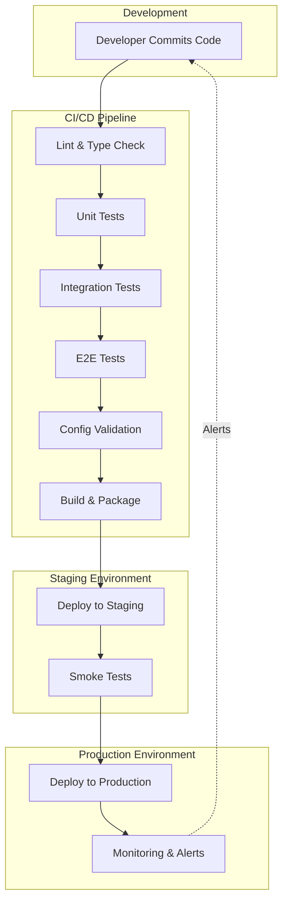
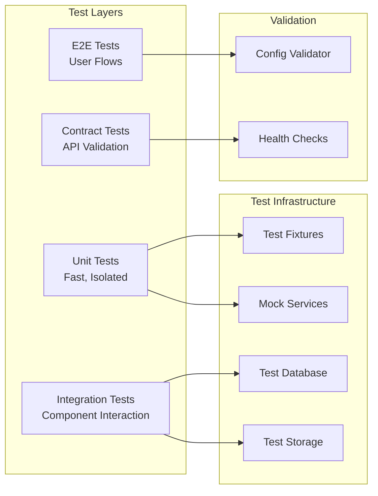

# Design Document: Production Quality Pipeline

## Overview

This design establishes a comprehensive production-quality development pipeline for the Instagram media AI platform. The pipeline addresses critical production failures through automated testing, configuration validation, error tracking, and CI/CD quality gates. The system implements a multi-layered testing strategy combining unit tests, integration tests, end-to-end tests, and contract tests, with monitoring and alerting for production environments.

The architecture follows a test pyramid approach: many fast unit tests at the base, fewer integration tests in the middle, and critical e2e tests at the top. All tests run automatically in CI/CD with quality gates preventing deployment of failing code.

## Architecture

### High-Level Architecture



### Testing Architecture



## Components and Interfaces

### 1. Test Suite Manager

**Purpose**: Orchestrates test execution across all modules and test types.

**Interface**:
```python
class TestSuiteManager:
    def run_all_tests(self) -> TestResults:
        """Run all test suites (unit, integration, e2e)"""
        
    def run_module_tests(self, module_name: str) -> TestResults:
        """Run tests for a specific module"""
        
    def generate_coverage_report(self) -> CoverageReport:
        """Generate code coverage report"""
        
    def get_test_results(self) -> TestResults:
        """Get aggregated test results"""
```

**Responsibilities**:
- Execute test suites in correct order
- Aggregate test results across modules
- Generate coverage reports
- Provide test execution metrics

### 2. Configuration Validator

**Purpose**: Validates environment configuration before tests and deployment.

**Interface**:
```python
class ConfigurationValidator:
    def validate_all(self) -> ValidationResult:
        """Validate all configuration"""
        
    def validate_aws_config(self) -> ValidationResult:
        """Validate AWS configuration (region, credentials)"""
        
    def validate_supabase_config(self) -> ValidationResult:
        """Validate Supabase configuration (buckets, credentials)"""
        
    def validate_api_keys(self) -> ValidationResult:
        """Validate all API keys are present and valid"""
        
    def run_health_checks(self) -> HealthCheckResults:
        """Run health checks for all external services"""
```

**Validation Rules**:
- All required environment variables present
- AWS region consistent across services (Bedrock, S3)
- Supabase bucket names exist and accessible
- API keys valid (test calls succeed)
- External services reachable (Supabase, AWS, ChromaDB, Apify)

### 3. API Contract Tester

**Purpose**: Validates API contracts between frontend and backend.

**Interface**:
```python
class APIContractTester:
    def validate_request(self, endpoint: str, request: dict) -> ValidationResult:
        """Validate request matches contract"""
        
    def validate_response(self, endpoint: str, response: dict) -> ValidationResult:
        """Validate response matches contract"""
        
    def validate_error_response(self, endpoint: str, error: dict) -> ValidationResult:
        """Validate error response matches contract"""
        
    def load_contract(self, contract_path: str) -> APIContract:
        """Load OpenAPI contract specification"""
```

**Contract Format** (OpenAPI 3.0):
```yaml
/api/brand-assets/upload:
  post:
    requestBody:
      required: true
      content:
        multipart/form-data:
          schema:
            type: object
            properties:
              file:
                type: string
                format: binary
              brand_id:
                type: string
    responses:
      200:
        content:
          application/json:
            schema:
              type: object
              properties:
                success:
                  type: boolean
                asset_id:
                  type: string
                storage_url:
                  type: string
      400:
        content:
          application/json:
            schema:
              type: object
              properties:
                error:
                  type: string
                details:
                  type: object
```

### 4. Error Tracker

**Purpose**: Captures, logs, and alerts on application errors.

**Interface**:
```python
class ErrorTracker:
    def capture_exception(self, exception: Exception, context: dict) -> None:
        """Capture exception with context"""
        
    def log_error(self, error_type: str, message: str, context: dict) -> None:
        """Log error with structured context"""
        
    def send_alert(self, severity: str, message: str) -> None:
        """Send alert for critical errors"""
        
    def get_error_metrics(self) -> ErrorMetrics:
        """Get error rate and distribution metrics"""
```

**Error Context Structure**:
```python
{
    "timestamp": "2024-01-15T10:30:00Z",
    "module": "brand_asset_upload",
    "error_type": "SupabaseStorageError",
    "message": "Bucket not found: brand-assets",
    "stack_trace": "...",
    "request": {
        "method": "POST",
        "url": "/api/brand-assets/upload",
        "headers": {...},
        "body": {...}
    },
    "user": {
        "session_id": "abc123",
        "user_id": "user_456"
    },
    "environment": {
        "aws_region": "us-east-1",
        "supabase_bucket": "brand-assets"
    }
}
```

### 5. User Flow Tester

**Purpose**: Executes end-to-end tests for critical user workflows.

**Interface**:
```python
class UserFlowTester:
    def test_brand_asset_upload_flow(self) -> FlowTestResult:
        """Test complete brand asset upload flow"""
        
    def test_content_ideation_flow(self) -> FlowTestResult:
        """Test complete content ideation flow"""
        
    def test_creative_studio_flow(self) -> FlowTestResult:
        """Test complete creative studio flow"""
        
    def test_media_generator_flow(self) -> FlowTestResult:
        """Test complete media generator flow"""
        
    def test_calendar_flow(self) -> FlowTestResult:
        """Test complete calendar CRUD flow"""
        
    def capture_failure_artifacts(self) -> FailureArtifacts:
        """Capture screenshots, logs, network requests on failure"""
```

**Flow Test Structure**:
```python
def test_brand_asset_upload_flow():
    # Setup
    browser = launch_browser()
    page = browser.new_page()
    
    # Navigate
    page.goto("/brand-assets")
    
    # Select file
    page.click("input[type='file']")
    page.set_input_files("test-logo.png")
    
    # Upload
    page.click("button:has-text('Upload')")
    
    # Wait for success
    page.wait_for_selector(".success-message")
    
    # Verify storage
    assert supabase.storage.exists("brand-assets/test-logo.png")
    
    # Cleanup
    browser.close()
```

### 6. CI/CD Quality Gate Manager

**Purpose**: Manages quality gates in the deployment pipeline.

**Interface**:
```python
class QualityGateManager:
    def run_lint_gate(self) -> GateResult:
        """Run linting and type checking"""
        
    def run_unit_test_gate(self) -> GateResult:
        """Run unit tests"""
        
    def run_integration_test_gate(self) -> GateResult:
        """Run integration tests"""
        
    def run_e2e_test_gate(self) -> GateResult:
        """Run e2e tests"""
        
    def run_config_validation_gate(self) -> GateResult:
        """Run configuration validation"""
        
    def run_smoke_test_gate(self) -> GateResult:
        """Run smoke tests in staging"""
        
    def should_allow_deployment(self) -> bool:
        """Check if all gates passed"""
```

**Gate Execution Order**:
1. Lint & Type Check (fastest, fail fast)
2. Unit Tests (fast, isolated)
3. Integration Tests (slower, requires services)
4. E2E Tests (slowest, full system)
5. Config Validation (verify deployment config)
6. Build & Deploy to Staging
7. Smoke Tests (verify staging works)
8. Deploy to Production (only if all gates pass)

### 7. Monitoring System

**Purpose**: Tracks application health, performance, and errors in production.

**Interface**:
```python
class MonitoringSystem:
    def track_api_metrics(self, endpoint: str, response_time: float, status: int) -> None:
        """Track API endpoint metrics"""
        
    def track_aws_usage(self, service: str, operation: str, cost: float) -> None:
        """Track AWS service usage and costs"""
        
    def track_supabase_metrics(self, operation: str, duration: float) -> None:
        """Track Supabase operation metrics"""
        
    def track_frontend_metrics(self, page: str, load_time: float, vitals: dict) -> None:
        """Track frontend performance metrics"""
        
    def create_alert(self, severity: str, message: str, context: dict) -> None:
        """Create alert for anomalies"""
        
    def get_dashboard_data(self) -> DashboardData:
        """Get data for monitoring dashboard"""
```

**Metrics Tracked**:
- API endpoint availability (uptime %)
- API response times (p50, p95, p99)
- Error rates by endpoint
- AWS Bedrock usage and costs
- Supabase storage usage
- Database query performance
- Frontend page load times
- Core Web Vitals (LCP, FID, CLS)

**Alert Thresholds**:
- Error rate > 5% → Warning alert
- API response time > 5s → Warning alert
- Service unavailable → Critical alert
- Error rate > 20% → Critical alert

## Data Models

### TestResults

```python
@dataclass
class TestResults:
    total_tests: int
    passed: int
    failed: int
    skipped: int
    duration: float
    coverage_percent: float
    failures: List[TestFailure]
    
@dataclass
class TestFailure:
    test_name: str
    module: str
    error_message: str
    stack_trace: str
    artifacts: List[str]  # Screenshots, logs, etc.
```

### ValidationResult

```python
@dataclass
class ValidationResult:
    is_valid: bool
    errors: List[ValidationError]
    warnings: List[ValidationWarning]
    
@dataclass
class ValidationError:
    field: str
    message: str
    expected: str
    actual: str
```

### HealthCheckResults

```python
@dataclass
class HealthCheckResults:
    all_healthy: bool
    services: Dict[str, ServiceHealth]
    
@dataclass
class ServiceHealth:
    service_name: str
    is_healthy: bool
    response_time: float
    error_message: Optional[str]
    last_check: datetime
```

### APIContract

```python
@dataclass
class APIContract:
    endpoint: str
    method: str
    request_schema: dict
    response_schema: dict
    error_schemas: Dict[int, dict]
    
@dataclass
class ContractValidationResult:
    is_valid: bool
    errors: List[str]
    warnings: List[str]
```

### ErrorMetrics

```python
@dataclass
class ErrorMetrics:
    total_errors: int
    error_rate: float
    errors_by_type: Dict[str, int]
    errors_by_module: Dict[str, int]
    recent_errors: List[ErrorEvent]
    
@dataclass
class ErrorEvent:
    timestamp: datetime
    error_type: str
    message: str
    module: str
    severity: str
```

### MonitoringMetrics

```python
@dataclass
class MonitoringMetrics:
    api_metrics: Dict[str, APIMetrics]
    aws_metrics: AWSMetrics
    supabase_metrics: SupabaseMetrics
    frontend_metrics: FrontendMetrics
    
@dataclass
class APIMetrics:
    endpoint: str
    request_count: int
    avg_response_time: float
    p95_response_time: float
    error_rate: float
    uptime_percent: float
```

## Correctness Properties

*A property is a characteristic or behavior that should hold true across all valid executions of a system—essentially, a formal statement about what the system should do. Properties serve as the bridge between human-readable specifications and machine-verifiable correctness guarantees.*


### Property Reflection

After analyzing all acceptance criteria, several properties can be consolidated:

**Consolidated Properties**:
- Requirements 1.1-1.5 (module-specific test suite validation) can be combined into one property about test suite correctness across all modules
- Requirements 6.1-6.7 (CI/CD gate ordering) can be combined into one property about gate execution sequence
- Requirements 2.1-2.3 (contract validation for requests, responses, errors) can be combined into one comprehensive contract validation property
- Requirements 4.1-4.5 (error logging with context) can be combined into one property about complete error context capture
- Requirements 11.1-11.4 (metric tracking) can be combined into one property about comprehensive metric collection
- Requirements 11.5-11.7 (alert triggering) can be combined into one property about threshold-based alerting

**Unique Properties Retained**:
- Configuration validation (3.1-3.7) - each validates different configuration aspects
- User flow testing (5.6-5.7) - distinct from module test suites
- Integration test behavior (7.6-7.7) - test isolation and cleanup
- Performance testing (8.1-8.7) - distinct performance characteristics
- Test data management (12.3-12.4, 12.7) - test isolation properties

### Core Correctness Properties

Property 1: Test Suite Module Coverage
*For any* module in the system (brand asset upload, content ideation, creative studio, media generator, calendar), when the test suite runs for that module, it should validate all critical operations specific to that module and catch failures in any operation.
**Validates: Requirements 1.1, 1.2, 1.3, 1.4, 1.5**

Property 2: Test Execution Sequence
*For any* test suite execution, tests should run in the correct sequence: unit tests first, then integration tests, then e2e tests, with each layer building on the previous.
**Validates: Requirements 1.6**

Property 3: Coverage Threshold Compliance
*For any* complete test suite execution, the generated coverage report should show at least 80% code coverage across all modules.
**Validates: Requirements 1.7, 10.7**

Property 4: API Contract Validation Completeness
*For any* API endpoint call (request, response, or error), the contract test should validate that the data structure matches the OpenAPI specification for that endpoint.
**Validates: Requirements 2.1, 2.2, 2.3**

Property 5: OpenAPI Contract Format Compliance
*For any* API contract specification in the system, it should be valid OpenAPI 3.0 format and parseable by OpenAPI validators.
**Validates: Requirements 2.5**

Property 6: Environment Variable Validation
*For any* configuration validation run, the validator should identify all missing or empty required environment variables and report them with clear error messages.
**Validates: Requirements 3.1**

Property 7: AWS Region Consistency
*For any* AWS configuration validation, if different AWS services (Bedrock, S3) are configured with different regions, the validator should detect and report the mismatch.
**Validates: Requirements 3.2**

Property 8: Supabase Bucket Accessibility
*For any* Supabase bucket referenced in configuration, the validator should verify the bucket exists and is accessible, catching the "bucket not found" error before runtime.
**Validates: Requirements 3.3**

Property 9: API Key Validity
*For any* API key in the configuration, the validator should verify the key is valid by making a test API call and catching invalid credentials before deployment.
**Validates: Requirements 3.4**

Property 10: Service Health Check Completeness
*For any* health check execution, the system should verify connectivity to all external services (Supabase, AWS Bedrock, ChromaDB, Apify) and report the health status of each.
**Validates: Requirements 3.5**

Property 11: Health Check Error Logging
*For any* failed health check, the logged error information should include service name, error type, and relevant configuration values for debugging.
**Validates: Requirements 3.6**

Property 12: Pre-Execution Validation
*For any* test suite execution or deployment, the configuration validator should run first and block execution if validation fails.
**Validates: Requirements 3.7**

Property 13: Complete Error Context Capture
*For any* error that occurs in the system, the error tracker should capture complete context including stack trace, request details, user session, and environment-specific information (AWS region, Supabase bucket, etc.).
**Validates: Requirements 4.1, 4.2, 4.3, 4.4, 4.5**

Property 14: Critical Error Alerting
*For any* critical error in production, the system should send a real-time alert to the development team within seconds of the error occurring.
**Validates: Requirements 4.7**

Property 15: User Flow Interaction Simulation
*For any* user flow test execution, the test should simulate real user interactions (clicks, form inputs, navigation) and verify the complete flow succeeds.
**Validates: Requirements 5.6**

Property 16: User Flow Failure Artifact Capture
*For any* user flow test failure, the system should capture debugging artifacts (screenshots, console logs, network requests) to enable post-mortem analysis.
**Validates: Requirements 5.7**

Property 17: CI/CD Quality Gate Sequence
*For any* code push to a branch, the CI/CD pipeline should execute quality gates in the correct sequence: lint → unit tests → integration tests → e2e tests → config validation → staging deployment → smoke tests → production deployment, with each gate blocking progression if it fails.
**Validates: Requirements 6.1, 6.2, 6.3, 6.4, 6.5, 6.6, 6.7**

Property 18: Quality Gate Failure Blocking
*For any* quality gate failure in the CI/CD pipeline, deployment should be blocked and developers should be notified with detailed failure information.
**Validates: Requirements 6.8**

Property 19: Integration Test Service Isolation
*For any* integration test that involves external services, the test should use test credentials and sandbox environments, never production credentials or data.
**Validates: Requirements 7.6, 12.7**

Property 20: Integration Test Cleanup
*For any* integration test execution, all test data created during the test should be cleaned up after completion to prevent pollution and interference with subsequent tests.
**Validates: Requirements 7.7, 12.4**

Property 21: API Performance Threshold Validation
*For any* performance test execution, the test should measure API response times and verify that the 95th percentile is under 2 seconds.
**Validates: Requirements 8.1**

Property 22: Image Generation Performance Validation
*For any* performance test execution, the test should measure image generation time and verify it completes within 30 seconds.
**Validates: Requirements 8.2**

Property 23: Concurrent Load Handling
*For any* performance test execution with 100 concurrent users, the system should handle the load without performance degradation (response times should remain within acceptable thresholds).
**Validates: Requirements 8.3**

Property 24: Transient Failure Recovery
*For any* simulated transient failure (network timeout, temporary service unavailability), the system should recover gracefully using retry logic with exponential backoff.
**Validates: Requirements 8.4, 8.5**

Property 25: Circuit Breaker Cascade Prevention
*For any* cascading failure scenario, circuit breakers should open to prevent cascade failures and protect downstream services.
**Validates: Requirements 8.6**

Property 26: Frontend Test Comprehensiveness
*For any* frontend test execution, the tests should validate component rendering, user interactions, state management, error handling, and loading states.
**Validates: Requirements 9.4**

Property 27: Frontend API Mocking
*For any* frontend unit test, API responses should be mocked to enable testing of error handling and loading states without depending on backend services.
**Validates: Requirements 9.5**

Property 28: Accessibility Validation
*For any* frontend test execution, accessibility checks using axe-core should run and identify any WCAG violations in the UI components.
**Validates: Requirements 9.6**

Property 29: Backend Test Fixture Usage
*For any* backend test execution, pytest fixtures should be used for test data setup and teardown, ensuring consistent test environments.
**Validates: Requirements 10.4**

Property 30: Backend Unit Test Mocking
*For any* backend unit test, external service calls (AWS, Supabase, Apify) should be mocked to ensure tests are fast and isolated.
**Validates: Requirements 10.5**

Property 31: Backend Integration Test Real Services
*For any* backend integration test, real service calls should be made to test environments (not mocked) to validate actual integration behavior.
**Validates: Requirements 10.6**

Property 32: Comprehensive Metric Collection
*For any* monitoring period, the monitoring system should collect metrics for API endpoints (availability, response times, error rates), AWS usage, Supabase operations, and frontend performance.
**Validates: Requirements 11.1, 11.2, 11.3, 11.4**

Property 33: Threshold-Based Alerting
*For any* metric that exceeds its threshold (error rate > 5%, response time > 5s, service unavailable), the monitoring system should trigger an alert with appropriate severity.
**Validates: Requirements 11.5, 11.6, 11.7**

Property 34: Test Data Generator Validity
*For any* test data generated by the test data generators, the generated data should be valid according to the system's validation rules and usable in tests.
**Validates: Requirements 12.2**

Property 35: Test Database Seeding
*For any* test execution, the test database should be seeded with consistent baseline data before tests run, ensuring reproducible test conditions.
**Validates: Requirements 12.3**

Property 36: Regression Suite Execution
*For any* production deployment, the full regression test suite should run and pass before deployment is allowed.
**Validates: Requirements 13.3**

Property 37: Regression Test Failure Blocking
*For any* regression test failure, the CI/CD pipeline should block deployment and create a high-priority ticket for investigation.
**Validates: Requirements 13.8**

## Error Handling

### Error Categories

1. **Configuration Errors**: Missing environment variables, invalid credentials, region mismatches
2. **Service Errors**: External service unavailability, API failures, timeout errors
3. **Test Failures**: Unit test failures, integration test failures, e2e test failures
4. **Deployment Errors**: Build failures, deployment failures, smoke test failures
5. **Runtime Errors**: Application errors in production, performance degradation

### Error Handling Strategy

**Configuration Errors**:
- Detect during configuration validation phase
- Block test execution and deployment
- Provide clear error messages with expected vs actual values
- Log to error tracker with full configuration context

**Service Errors**:
- Implement retry logic with exponential backoff
- Use circuit breakers to prevent cascade failures
- Log to error tracker with service-specific context
- Alert on repeated failures or service unavailability

**Test Failures**:
- Capture failure artifacts (logs, screenshots, network traces)
- Block deployment in CI/CD pipeline
- Notify developers with failure details
- Provide debugging runbooks for common failures

**Deployment Errors**:
- Rollback to previous version automatically
- Alert operations team immediately
- Log detailed deployment context
- Prevent production deployment until resolved

**Runtime Errors**:
- Capture full error context (stack trace, request, user session)
- Log to monitoring system
- Alert on critical errors or high error rates
- Provide investigation runbooks for common errors


### Error Recovery Mechanisms

**Retry Logic**:
```python
def retry_with_backoff(func, max_retries=3, base_delay=1):
    for attempt in range(max_retries):
        try:
            return func()
        except TransientError as e:
            if attempt == max_retries - 1:
                raise
            delay = base_delay * (2 ** attempt)
            time.sleep(delay)
            error_tracker.log_retry(func.__name__, attempt, delay)
```

**Circuit Breaker**:
```python
class CircuitBreaker:
    def __init__(self, failure_threshold=5, timeout=60):
        self.failure_count = 0
        self.failure_threshold = failure_threshold
        self.timeout = timeout
        self.state = "closed"  # closed, open, half_open
        self.last_failure_time = None
    
    def call(self, func):
        if self.state == "open":
            if time.time() - self.last_failure_time > self.timeout:
                self.state = "half_open"
            else:
                raise CircuitOpenError("Circuit breaker is open")
        
        try:
            result = func()
            if self.state == "half_open":
                self.state = "closed"
                self.failure_count = 0
            return result
        except Exception as e:
            self.failure_count += 1
            self.last_failure_time = time.time()
            if self.failure_count >= self.failure_threshold:
                self.state = "open"
            raise
```

## Testing Strategy

### Test Pyramid Structure

The testing strategy follows the test pyramid approach:

```
         /\
        /  \  E2E Tests (Few, Slow, High Value)
       /____\
      /      \
     / Integ. \ Integration Tests (Some, Medium Speed)
    /__________\
   /            \
  /  Unit Tests  \ Unit Tests (Many, Fast, Focused)
 /________________\
```

### Test Types and Coverage

**Unit Tests** (Target: 80% code coverage):
- Test individual functions, classes, and components in isolation
- Mock all external dependencies
- Fast execution (< 1 second per test)
- Run on every code change
- Technologies: pytest (backend), React Testing Library (frontend)

**Integration Tests** (Target: Critical integration points):
- Test component interactions and data flow
- Use test databases and test storage buckets
- Medium execution time (1-10 seconds per test)
- Run before deployment
- Technologies: pytest with test fixtures, Playwright for frontend integration

**E2E Tests** (Target: Critical user flows):
- Test complete user workflows from UI to database
- Use staging environment
- Slow execution (10-60 seconds per test)
- Run before production deployment
- Technologies: Playwright or Cypress

**Contract Tests** (Target: All API endpoints):
- Validate API request/response schemas
- Ensure frontend-backend compatibility
- Fast execution (< 1 second per test)
- Run on every API change
- Technologies: Pact or OpenAPI validators


### Module-Specific Testing

**Brand Asset Upload Module**:
- Unit tests: File validation, storage client methods
- Integration tests: Upload to Supabase storage, database record creation
- E2E tests: Complete upload flow from UI to storage confirmation
- Regression tests: Supabase bucket 400 error

**Content Ideation Module**:
- Unit tests: Prompt processing, response parsing
- Integration tests: API calls to LLM providers, ChromaDB retrieval
- E2E tests: Enter prompt → generate ideas → display results
- Regression tests: Blank page rendering, no results handling

**Creative Studio Module**:
- Unit tests: Post generation logic, tone scoring algorithms
- Integration tests: Multi-step workflow, result storage
- E2E tests: Create post → score tone → generate output
- Regression tests: Non-functional buttons, UX flow completion

**Media Generator Module**:
- Unit tests: Parameter validation, image processing
- Integration tests: AWS Bedrock calls with correct region
- E2E tests: Configure parameters → generate image → display result
- Regression tests: AWS region mismatch (eu-north-1 vs us-east-1)

**Calendar Module**:
- Unit tests: Date validation, event creation logic
- Integration tests: CRUD operations, database persistence
- E2E tests: Create → view → reschedule → delete event
- Regression tests: Missing delete/reschedule functionality

### Test Data Management

**Test Fixtures**:
```python
@pytest.fixture
def sample_brand_asset():
    return {
        "file_name": "test-logo.png",
        "file_size": 1024,
        "mime_type": "image/png",
        "brand_id": "test-brand-123"
    }

@pytest.fixture
def sample_content_idea():
    return {
        "prompt": "Generate Instagram post ideas for a coffee shop",
        "tone": "friendly",
        "target_audience": "millennials"
    }
```

**Test Data Generators**:
```python
def generate_random_brand_asset():
    return {
        "file_name": f"test-{uuid.uuid4()}.png",
        "file_size": random.randint(100, 10000),
        "mime_type": random.choice(["image/png", "image/jpeg"]),
        "brand_id": f"brand-{uuid.uuid4()}"
    }
```

**Test Database Seeding**:
```python
def seed_test_database():
    # Create baseline test data
    test_brands = create_test_brands(count=5)
    test_users = create_test_users(count=10)
    test_assets = create_test_assets(count=20)
    return {
        "brands": test_brands,
        "users": test_users,
        "assets": test_assets
    }
```

**Test Cleanup**:
```python
@pytest.fixture(autouse=True)
def cleanup_after_test():
    yield
    # Cleanup test data
    delete_test_data_from_database()
    delete_test_files_from_storage()
    clear_test_cache()
```


### CI/CD Pipeline Configuration

**GitHub Actions Workflow** (example):
```yaml
name: Production Quality Pipeline

on:
  push:
    branches: [main, develop]
  pull_request:
    branches: [main]

jobs:
  lint-and-typecheck:
    runs-on: ubuntu-latest
    steps:
      - uses: actions/checkout@v3
      - name: Run linting
        run: |
          cd backend && flake8 .
          cd frontend && npm run lint
      - name: Run type checking
        run: |
          cd backend && mypy .
          cd frontend && npm run typecheck

  unit-tests:
    needs: lint-and-typecheck
    runs-on: ubuntu-latest
    steps:
      - uses: actions/checkout@v3
      - name: Run backend unit tests
        run: cd backend && pytest tests/unit/ --cov
      - name: Run frontend unit tests
        run: cd frontend && npm run test:unit

  integration-tests:
    needs: unit-tests
    runs-on: ubuntu-latest
    steps:
      - uses: actions/checkout@v3
      - name: Setup test environment
        run: ./scripts/setup-test-env.sh
      - name: Run integration tests
        run: pytest tests/integration/

  e2e-tests:
    needs: integration-tests
    runs-on: ubuntu-latest
    steps:
      - uses: actions/checkout@v3
      - name: Run e2e tests
        run: npx playwright test

  config-validation:
    needs: e2e-tests
    runs-on: ubuntu-latest
    steps:
      - uses: actions/checkout@v3
      - name: Validate configuration
        run: python scripts/validate_config.py

  deploy-staging:
    needs: config-validation
    runs-on: ubuntu-latest
    steps:
      - name: Deploy to staging
        run: ./scripts/deploy-staging.sh
      - name: Run smoke tests
        run: ./scripts/smoke-tests.sh

  deploy-production:
    needs: deploy-staging
    if: github.ref == 'refs/heads/main'
    runs-on: ubuntu-latest
    steps:
      - name: Deploy to production
        run: ./scripts/deploy-production.sh
```

### Monitoring and Alerting Configuration

**Metrics Collection**:
```python
class MetricsCollector:
    def __init__(self):
        self.metrics_backend = CloudWatch()  # or DataDog, Prometheus
    
    def track_api_call(self, endpoint, response_time, status_code):
        self.metrics_backend.put_metric(
            namespace="InstaMediaAI",
            metric_name="APIResponseTime",
            value=response_time,
            dimensions={
                "Endpoint": endpoint,
                "StatusCode": status_code
            }
        )
    
    def track_error(self, module, error_type):
        self.metrics_backend.increment_counter(
            namespace="InstaMediaAI",
            metric_name="ErrorCount",
            dimensions={
                "Module": module,
                "ErrorType": error_type
            }
        )
```

**Alert Configuration**:
```python
alerts = [
    {
        "name": "HighErrorRate",
        "condition": "error_rate > 0.05",
        "severity": "warning",
        "notification": ["team@example.com"]
    },
    {
        "name": "ServiceUnavailable",
        "condition": "service_health == 'down'",
        "severity": "critical",
        "notification": ["team@example.com", "oncall@example.com"]
    },
    {
        "name": "SlowAPIResponse",
        "condition": "p95_response_time > 5000",
        "severity": "warning",
        "notification": ["team@example.com"]
    }
]
```

### Performance Testing Configuration

**Load Testing with Locust**:
```python
from locust import HttpUser, task, between

class InstaMediaAIUser(HttpUser):
    wait_time = between(1, 3)
    
    @task(3)
    def generate_content_ideas(self):
        self.client.post("/api/content-ideation", json={
            "prompt": "Generate post ideas",
            "tone": "professional"
        })
    
    @task(2)
    def upload_brand_asset(self):
        files = {"file": ("test.png", open("test.png", "rb"), "image/png")}
        self.client.post("/api/brand-assets/upload", files=files)
    
    @task(1)
    def generate_image(self):
        self.client.post("/api/media-generator", json={
            "prompt": "Coffee shop logo",
            "style": "modern"
        })
```

## Implementation Notes

### Technology Stack for Testing

**Backend Testing**:
- pytest: Test framework
- pytest-cov: Coverage reporting
- pytest-mock: Mocking framework
- responses: HTTP mocking
- faker: Test data generation

**Frontend Testing**:
- Vitest: Test framework (Vite-native)
- React Testing Library: Component testing
- Playwright: E2E testing
- axe-core: Accessibility testing
- MSW (Mock Service Worker): API mocking

**CI/CD**:
- GitHub Actions: Pipeline orchestration
- Docker: Containerization for consistent environments
- AWS CodeDeploy: Production deployment

**Monitoring**:
- AWS CloudWatch: Metrics and logs
- Sentry: Error tracking
- DataDog (optional): Advanced monitoring

### Development Workflow

1. Developer writes code with tests
2. Run tests locally: `pytest` and `npm test`
3. Push code to branch
4. CI/CD pipeline runs automatically
5. All quality gates must pass
6. Code review and approval
7. Merge to main triggers staging deployment
8. Smoke tests run in staging
9. Manual approval for production deployment
10. Production deployment with monitoring

### Rollback Strategy

If production deployment fails or critical issues are detected:
1. Automatic rollback to previous version
2. Alert operations team
3. Investigate using error tracker logs
4. Fix issue in development
5. Re-run full pipeline
6. Deploy fix to production

This comprehensive testing and quality assurance framework ensures that production issues are caught early, deployments are safe, and the system remains reliable and maintainable.
